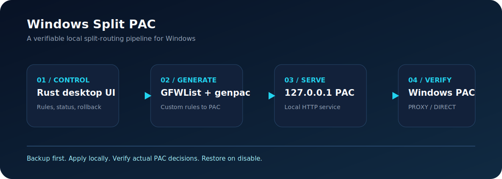

# Windows Split PAC

[](https://github.com/FuzzySoul/windows-split-pac/actions/workflows/ci.yml)
[](https://github.com/FuzzySoul/windows-split-pac/releases)
[](LICENSE)

[简体中文](README.md) | [English](README.en.md)

A native Windows split-routing control center. It builds a PAC file from GFWList and custom domain rules, sends matching sites to an HTTP proxy, and keeps the rest of the traffic direct. No Clash, Mihomo, or SOCKS5 is required, and existing Windows proxy settings are backed up before the tool changes them.



## Why it is different

- **One-click control**: install dependencies, build PAC, start the local service, and apply the Windows automatic proxy script from one dashboard.
- **Recoverable by design**: the first enable operation saves the current user's PAC, manual proxy, bypass list, and auto-detect settings. Disable restores them.
- **Verifiable routing**: Windows JScript evaluates the PAC and reports a real `PROXY` and `DIRECT` decision instead of merely checking that a process exists.
- **Privacy-first**: proxy endpoints and proxy-setting backups stay under the Git-ignored local `data/` directory. No telemetry is collected.

## Get started in three minutes

1. Open [Releases](https://github.com/FuzzySoul/windows-split-pac/releases) and download `WindowsSplitPAC.zip` with its `.sha256` checksum file.
2. Extract the ZIP anywhere. Optionally verify the download:

   ```powershell
   Get-FileHash .\WindowsSplitPAC.zip -Algorithm SHA256
   ```

3. Double-click `Start-WindowsSplitPAC.cmd` and select `简体中文` or `English`.
4. Enter an Every Proxy HTTP endpoint such as `192.168.1.100:8080`, without `http://`.
5. Enable autostart if needed, then select **Enable smart routing**.
6. Select **Run split test** and confirm one domain returns `PROXY` while another returns `DIRECT`.

When enabled, Windows uses:

```text
http://127.0.0.1:8765/proxy.pac
```

**Stop and disable routing** stops the local service and restores the backed-up Windows proxy settings. For an older installation without a backup, it removes only this tool's PAC URL and leaves existing manual proxy values untouched.

## Rules and scope

GFWList is a proxy rule list, not a strict domestic/international website dictionary. Domains that do not match stay direct. Add custom rules in the dashboard's diagnostics panel:

```text
||example.com     # force proxy
@@||example.com   # force direct
```

Save and enable smart routing again to regenerate the PAC. This project supports HTTP upstream proxies only; it does not configure SOCKS5, Clash, or Mihomo.

## Architecture

| Layer | Implementation | Responsibility |
| --- | --- | --- |
| Desktop control center | Rust + egui | Bilingual UI, state, rule editing, rollback |
| PAC generation | genpac + GFWList | Compile rules into a PAC file |
| Local service | Python | Serve PAC with the expected MIME type on `127.0.0.1:8765` |
| Windows integration | PowerShell + WinINet | Save, apply, refresh, and restore current-user proxy settings |
| Verification | PowerShell + JScript | Evaluate actual PAC `PROXY` / `DIRECT` decisions |

## Quality gates

Every push runs in a clean Windows runner:

- Rust formatting, Clippy with warnings denied, and unit tests.
- PAC isolation: PowerShell parsing, backup/restore against a temporary registry key, temporary PAC generation, HTTP/MIME checks, and real routing decisions.
- Release delivery: a `v*` tag builds a portable ZIP, generates SHA-256, and creates a GitHub Release.

Preview builds are available from **Actions -> Build Windows Package**. Prefer checksum-backed Release assets for normal use.

## Build from source

Install Python 3 and Rust stable, then run:

```powershell
python -m pip install -r requirements.txt
cargo run --release --manifest-path rust-gui\Cargo.toml
```

`scripts\Test-Package.ps1` performs isolated validation in a temporary directory and does not change Windows proxy settings.

## Contributing and security

- [Contribution guide](CONTRIBUTING.md)
- [Security policy and privacy notes](SECURITY.md)
- [Changelog](CHANGELOG.md)
- [MIT License](LICENSE)

Never include proxy endpoints, PAC files, cookies, passwords, or private-network data in issues and logs.
