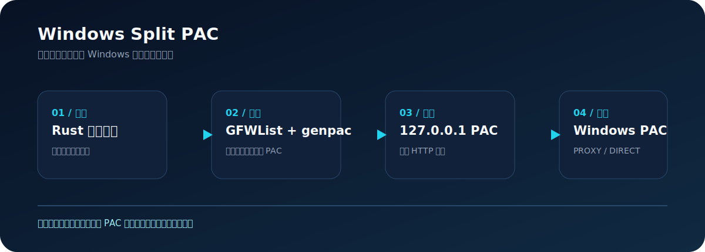

# Windows Split PAC

[](https://github.com/FuzzySoul/windows-split-pac/actions/workflows/ci.yml)
[](https://github.com/FuzzySoul/windows-split-pac/releases)
[](LICENSE)

[简体中文](README.md) | [English](README.en.md)

Windows 原生分流控制台：使用 GFWList 与自定义域名规则生成 PAC，将命中的站点交给 HTTP 代理，其余流量保持直连。它不需要 Clash、Mihomo 或 SOCKS5，并且会在启用前备份现有 Windows 代理设置。



## 为什么使用它

- **一键控制**：输入 HTTP 代理地址后，自动安装依赖、生成 PAC、启动本机服务并配置 Windows 自动代理脚本。
- **可恢复**：首次启用时备份当前用户的 PAC、手动代理、例外列表和自动检测设置；关闭时自动恢复。
- **可验证**：使用 Windows JScript 实际执行 PAC，显示一个 `PROXY` 与一个 `DIRECT` 决策，而不是只检查进程是否运行。
- **隐私优先**：代理地址和代理设置备份仅保存在被 Git 忽略的本地 `data/` 目录；项目不收集遥测数据。

## 三分钟开始

1. 前往 [Releases](https://github.com/FuzzySoul/windows-split-pac/releases)，下载 `WindowsSplitPAC.zip` 与对应的 `.sha256` 校验文件。
2. 解压 ZIP 到任意目录，可选地验证下载完整性：

   ```powershell
   Get-FileHash .\WindowsSplitPAC.zip -Algorithm SHA256
   ```

3. 双击 `Start-WindowsSplitPAC.cmd`，选择 `简体中文` 或 `English`。
4. 输入手机 Every Proxy 的 HTTP 地址，例如 `192.168.1.100:8080`，不要输入 `http://`。
5. 需要登录后保持服务时，勾选开机自启，然后点击“启用智能分流”。
6. 点击“测试是否分流”，确认命中域名显示 `PROXY`、直连域名显示 `DIRECT`。

启用后，Windows 使用的 PAC 地址为：

```text
http://127.0.0.1:8765/proxy.pac
```

点击“停止并关闭分流”会关闭本地服务，并恢复启用前保存的 Windows 代理设置。若从旧版迁移而没有备份，程序只会删除自己的 PAC 地址，不会清空你现有的手动代理。

## 规则与范围

GFWList 是代理规则列表，并不是严格的“国内/国外网站字典”。未命中的域名默认直连；你可以在 GUI 的“自定义规则与诊断”区域加入规则：

```text
||example.com     # 强制走代理
@@||example.com   # 强制直连
```

保存后再次点击“启用智能分流”即可重新生成 PAC。这个工具只支持 HTTP 上游代理，不配置 SOCKS5、Clash 或 Mihomo。

## 架构

| 层 | 实现 | 职责 |
| --- | --- | --- |
| 桌面控制台 | Rust + egui | 双语 UI、状态展示、规则编辑、失败回滚 |
| PAC 生成 | genpac + GFWList | 将规则编译为 PAC 文件 |
| 本机服务 | Python | 在 `127.0.0.1:8765` 提供正确 PAC MIME 类型 |
| Windows 集成 | PowerShell + WinINet | 保存、应用、刷新并恢复当前用户代理设置 |
| 验证 | PowerShell + JScript | 实际求值 PAC 的 `PROXY` / `DIRECT` 决策 |

## 质量保证

每次推送都会在干净的 Windows Runner 上运行：

- Rust：`cargo fmt --check`、`cargo clippy -D warnings`、单元测试。
- PAC：PowerShell 入口解析、临时注册表项中的备份恢复测试、临时 PAC 生成、HTTP/MIME 校验和真实路由决策测试。
- 发布：推送 `v*` 标签时构建可携带 ZIP、生成 SHA-256，并自动创建 GitHub Release。

预览构建可从 **Actions -> Build Windows Package** 获取；正式使用请优先下载 Releases 中带校验文件的版本。

## 从源代码运行

安装 Python 3 与 Rust stable 后：

```powershell
python -m pip install -r requirements.txt
cargo run --release --manifest-path rust-gui\Cargo.toml
```

运行 `scripts\Test-Package.ps1` 可在临时目录完成隔离验证，不会修改 Windows 代理设置。

## 参与与安全

- [贡献指南](CONTRIBUTING.md)
- [安全策略与隐私说明](SECURITY.md)
- [变更日志](CHANGELOG.md)
- [MIT 许可证](LICENSE)

提交 issue 或日志时，请勿包含代理地址、PAC 文件、Cookie、密码或内网信息。
