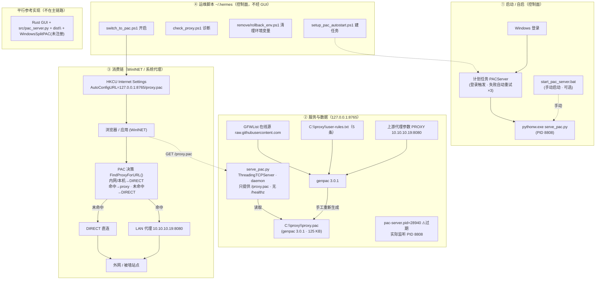

# 实际运行体系架构（LIVE SERVICE ARCHITECTURE）

> 本文所有信息来自 **2026-08-19 对 Windows 本机的实时探测（只读，未改动任何东西）**，
> 描述的是**线上真正在跑**的 PAC 分流体系，不是仓库里那套 Rust GUI 的平行实现。
>
> 配套图形：`docs/ARCHITECTURE-LIVE-SERVICE.svg`（可直接用浏览器打开）。

---

## 1. 一图看懂

```
docs/ARCHITECTURE-LIVE-SERVICE.svg   ← 渲染后的架构图（浏览器打开）
```

Mermaid 版本（GitHub / Typora 可直接渲染）：



---

## 2. 组件清单（全部为实测）

| 角色 | 名称 | 实测状态（2026-08-19） |
| --- | --- | --- |
| 启动器 | 计划任务 `PACServer` | **Running**，登录触发，`pythonw.exe C:\Users\62003\.hermes\serve_pac.py`，失败自动重试 ×3（1 分钟间隔） |
| 手动备份 | `start_pac_server.bat` | 同一条命令，手工单次启动用 |
| 服务进程 | `serve_pac.py` | **PID 8808**，监听 `127.0.0.1:8765`，`ThreadingTCPServer` + `daemon_threads`，`allow_reuse_address=True`；仅有 `/proxy.pac` 路由，**无 `/healthz`** |
| PAC 数据 | `C:\proxy\proxy.pac` | 125 KB，genpac 3.0.1（头注释 Generated 2026-07-02，文件 mtime 2026-08-17），上游 `PROXY 10.10.10.19:8080` |
| 自定义规则 | `C:\proxy\user-rules.txt` | 5 条：mrds66.com / 91cg1.com / fuzzysoulfate…hf.space / jcomic.net / 18comic.vip |
| 生成器 | `genpac 3.0.1`（Python Scripts） | 无自动化打包脚本，靠手工重跑；输入 GFWList 在线 + user-rules + 上游参数 |
| 消费端 | Windows 注册表 `HKCU\...\Internet Settings` | `AutoConfigURL=http://127.0.0.1:8765/proxy.pac`（生效）；`ProxyEnable=0`；`ProxyServer` 残留 `10.10.10.19:8080`（不生效） |
| 环境变量 | HKCU `HTTP_PROXY/HTTPS_PROXY/NO_PROXY` | 均为空（已被清理，避免破坏鸣潮启动器） |
| 无关任务 | 系统自带 `Proxy`(acproxy.dll) | Ready，与本服务无关，勿动 |
| 运行时残留 | `C:\proxy\pac-server.{pid,stdout,stderr}.log` | pid=28940 **已过期**；stdout 空；stderr 有历史 6871B |
| 平行实现 | 仓库 Rust GUI / `src/pac_server.py` / `dist\` / `WindowsSplitPAC` | 任务**未注册**，不在主链路，仅作参考 |

---

## 3. 两条关键链路

### 3.1 处理请求（数据面）
```
浏览器/应用 → WinINET/系统代理 → GET http://127.0.0.1:8765/proxy.pac
   → serve_pac.py 读 C:\proxy\proxy.pac（200 + MIME: application/x-ns-proxy-autoconfig + no-cache）
   → FindProxyForURL() 决策：
       本机/内网(10/8, 172.16/12, 192.168/16) → DIRECT
       命中规则(开白/黑名单+user-rules)       → PROXY 10.10.10.19:8080 或 DIRECT
       未命中                              → DIRECT
```

### 3.2 启动 / 切换（控制面）
```
Windows 登录 → 计划任务 PACServer → pythonw.exe serve_pac.py（8/19 实测 PID 8808）
   ▪ switch_to_pac.ps1      写 AutoConfigURL + ProxyEnable=0 + 清 ProxyServer
   ▪ check_proxy.ps1        诊断注册表 / 用户代理环境变量 / genpac
   ▪ remove_proxy_env.ps1  删 HTTP_PROXY / HTTPS_PROXY / NO_PROXY（鸣潮）
   ▪ rollback_env.ps1       兜底清空上/小写全部代理环境变量
   ▪ setup_pac_autostart.ps1 建 PACServer 计划任务（含重试容错）
```

---

## 4. 实测发现的 4 个问题（也是后续开发的切入点）

1. **pid 文件长期过期**：`pac-server.pid=28940`（7/15）与实际监听 PID 8808（8/19）不符。
   原因：`serve_pac.py` 及其启动流程**从不回写 pid 文件**，只能在启动时由外层脚本写。
   → 检测必须以「端口监听者 + 命令行」为准，pid 文件只作辅助（`scripts/Get-ServiceIdentity.ps1` 已按此实现）。
2. **改规则 ≠ 立即生效，且无自动化**：`proxy.pac` 只烧入了 3/5 条规则
   （缺 `fuzzysoulfate…hf.space`、`jcomic.net`；`18comic` 用的是旧域名 `.org` 而非规则里的 `.vip`）。
   原因：改 `user-rules.txt` 之后**从未重新运行 genpac** 更新 `proxy.pac`。
   → 「编辑规则 → 重新生成 PAC → 刷新/重启服务」这条管线目前是**手工断裂**的。
3. **无健康检查**：线上 `serve_pac.py` 只有 `/proxy.pac`，没有 `/healthz`；仓库 `src/pac_server.py` 有，可移植。
4. **多套并存**：仓库 GUI 是平行实现（自己的 Start/Stop、`WindowsSplitPAC` 任务、`dist\` 产物），
   若不分清「谁在跑」，GUI 会自说自话；识别能力已落地在 `Get-ServiceIdentity.ps1` + GUI「当前服务识别」横幅。

---

## 5. 后续开发指向

按 `docs/ANALYSIS-GUI-vs-LIVE-SCRIPT.md` 的主线策略：
把仓库 GUI 重构成「真实服务（serve_pac.py + C:\proxy\）的控制面板」，而不是再造一套平行服务。优先顺序：

1. 让规则编辑与 PAC 重新生成打通（补上第 2 条断裂的管线，最安全、最快见效）；
2. 给真实服务补 `/healthz` 并让启动流程回写 pid 文件（消除第 1、3 条隐患）；
3. 最后才动 GUI 的按钮/布局（需 Windows 原生编译验证）。
