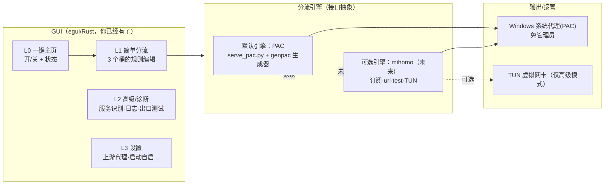

# 调研与开发方案：PAC 分流能否对标 Clash Verge？

> 目标产品三句话：
> **懒人一键**（默认零配置就能用）· **方便**（常用操作 ≤2 步）· **高级设置**（给进阶用户留深度）
> 但**分流一定要非常简洁易懂**（心智模型极简，不堆术语）。
>
> 本文先解剖对标物 **Clash Verge Rev**，再说实话 **PAC 方案的可行性与硬边界**，
> 最后给出**默认 PAC + 可插拔引擎**的开发方案与路线图。
> 调研时间：2026-08-19；结论仅适用于「Windows 桌面 + 本机自有上游代理 + 以浏览器/上网为主」的典型场景。

---

## 0. TL;DR（结论先行）

- **「核心逻辑用 PAC 分流」完全可行**，而且对你「懒人一键 + 分流简洁易懂」的定位是**最匹配的默认核心**——你线上那套 `serve_pac.py + C:\proxy` 本质上就是这个方案，跑得好好的。
- **但不能对标到 Clash Verge 的全部**：PAC 天然不做「订阅节点、按延迟自动选择、UDP/游戏/TUN、进程级规则、REJECT / 负载均衡 / 全域 DNS 防泄漏」这些事。**这些恰恰是 Clash 复杂度的来源**，也是「不简洁」的根源。
- **所以产品策略不是二选一，而是分层**：
  - **默认层（L0–L2）用 PAC**：零权限、无驱动、秒启、小体积、规则直达心智；
  - **高级层（L3）把"分流引擎"抽象成接口**，未来可插 mihomo（Clash 内核）做游戏/流媒体/多机场订阅；
  - **界面永远只暴露 3 个桶**：`强制走代理 / 强制直连 / 其余智能(GFWList)`，把 genpac、规则链、策略组全部藏起来。
- 依据：Clash Verge Rev 官方特性、mihomo 规则/策略组模型、PAC 规范(MDN/Wikipedia)与 v2rayN「从 PAC 模式迁到核心内路由」的行业演进。

---

## 1. 先对齐：三个关键词 = 三种约束

| 关键词 | 它到底想要什么 | 对技术选型的约束 |
| --- | --- | --- |
| 懒人一键 | 装上→填一个代理→点一下→能用；别让用户理解节点 | 核心要**免管理员**、**无驱动**、**秒启** |
| 方便 | 日常操作（开/关、加一条规则）≤2 步 | UI 只留一个主按钮 + 一个规则入口 |
| 高级设置 | 进阶用户能看到深度：诊断、服务识别、订阅、链式 | 要有一层**高级/诊断视图**，且不影响默认 |
| 分流简洁易懂 | 「这个网站走代理 / 这个网站直连」，一句话说清 | 规则模型必须是**扁平的可数列表**，不是多层策略组 |

> 注意：Clash Verge「规则 → 策略组(select/url-test/fallback) → 节点」是一棵**多级树**，
> 这正是它强大、也正是不容易一句话讲清的地方。你的产品目标反之，所以要刻意砍树。

---

## 2. 对标物解剖：Clash Verge Rev 是什么

### 2.1 事实（来自官方仓库/文档，2026-08 状态）
- 定位：**Clash Verge（zzzgydi，已停更）的延续**，基于 **Tauri 2 + Rust 后端 + React/MUI 前端**的桌面壳。
- 内核：内置 **Clash.Meta / mihomo（Go 写的 rule-based tunnel）**，可切换 Alpha 内核。
- 关键能力：
  - **订阅/配置文件管理**：机场订阅链接 → 配置文件 → Merge/Script 增强（JS 改写 config）→ WebDAV 备份同步；
  - **两种流量接管**：系统代理（WinINET，需无特权）+ **TUN 虚拟网卡**（服务模式，需装虚拟网卡驱动）；
  - **可视化节点/规则编辑**、策略组图标、主题/CSS 注入、托盘；
  - 三种路由模式：**规则 / 全局 / 直连**（见官方名词解释页）。
- 许可证：**GPL-3.0**（对它、对 mihomo 都一样）——若把它/内核嵌进你的商业产品，发行需 GPL 兼容。

### 2.2 它的"分流"到底长什么样（mihomo 模型）
```
规则(rules) —— 从上到下第一条命中生效：
  DOMAIN-SUFFIX,baidu.com,DIRECT           # 域名后缀 → 直连
  GEOSITE,cn,DIRECT                        # 中国域名集 → 直连
  GEOIP,CN,DIRECT                          # 中国 IP → 直连
  GEOSITE,netflix,🎬 流媒体                 # → 某个"策略组"
  RULE-SET,reject_domainset,REJECT         # → 拒绝
  MATCH,节点选择                            # 兜底 → "节点选择"组

策略组(proxy-groups) —— 规则做路由时引用到的"目标"：
  - 类型 select   ：用户手动选（GUI 下拉）
  - 类型 url-test ：按测速自动选最快
  - 类型 fallback ：按顺序保活优先
  - 类型 load-balance / relay / ssid-policy ……

节点(proxies) —— 策略组的叶子：ss / vmess / trojan / hysteria2 …
```
- 规则触发靠**核心内的 DNS/流量**，不是浏览器；因此能做 IP 规则、进程规则、TUN 全局。
- 触发库/规则集可离线（rule-providers），但整体心智是**多层树**。

---

## 3. PAC 方案的技术真相

### 3.1 它到底是什么
`proxy.pac` 是一个 JS 脚本，只暴露一个 `FindProxyForURL(url, host)`，返回 `DIRECT` 或一个代理列表（`PROXY a; PROXY b; DIRECT` 表示依次尝试）。
由 **Windows WinINET** 调用：浏览器/遵循系统代理的应用发请求时先问它"这个网址该走哪"。来源：[MDN PAC](https://developer.mozilla.org/en-US/docs/Web/HTTP/Guides/Proxy_servers_and_tunneling/Proxy_Auto-Configuration_PAC_file)、[Wikipedia PAC](https://en.wikipedia.org/wiki/Proxy_auto-config)。

### 3.2 能力清单（哪些可以放心给产品）
| 能力 | PAC 支持度 |
| --- | --- |
| 域名规则：`shExpMatch` / `dnsDomainIs` / Host 后缀匹配 | ✅ 原生（且字符串匹配不触发 DNS） |
| 「新代理列表」「多个代理依次尝试（连接级 failover）」 | ✅ `"PROXY a:8080; PROXY b:8080; DIRECT"` |
| 内网/本机直连 | ✅ `isInNet`/`isPlainHostName` |
| 免管理员、无驱动、秒启、内存≈0 | ✅ 这是 PAC 的独有优势 |
| 规则模型 = 扁平的「域名→去向」 | ✅ 对「简洁易懂」最友好 |
| 上游变化（换代理地址）→ 只需重新生成 PAC | ✅ 但要客户端重新拉取（有缓存坑） |

### 3.3 硬边界（不要说谎的地方）
| 边界 | 说明 | 来源 |
| --- | --- | --- |
| **只覆盖遵守系统代理的应用** | 浏览器/多数 WinINET 应用 👌；命令行工具、游戏、不规范软件 👎 | [v2rayN PAC 模式局限](https://mahu.blog/article/exe7y32v/)、[知乎-代理基础](https://zhuanlan.zhihu.com/p/606905857) |
| **系统代理≈纯 TCP(HTTP/SOCKS)** | UDP 流量基本不接管 → 语音/联机游戏/QUIC 不在范围内；ICMP(ping) 任何代理都管不了（要 VPN/TUN） | [CSDN-系统代理与Tun模式详解](https://blog.csdn.net/m0_73640344/article/details/144094115)、[XTLS-代理UDP全解析](https://github.com/XTLS/Xray-core/discussions/237) |
| **无节点订阅/延迟自动选择** | PAC 只能在**生成时**写死一个代理地址；按延迟挑节点、机场自动更新、测速切换都不存在 | 行业演进证据：[v2rayN 从 PAC 模式改为"自动配置系统代理+核心内路由"](https://github.com/2dust/v2rayN/discussions/3240) |
| **规则在"生成时"固化** | 改一条规则必须重新生成 PAC；GEOIP 类 IP 规则要依赖 `dnsResolve`（且会拖慢/泄露 DNS） | MDN：字符串匹配函数避免 DNS；用代理则代理侧做 DNS |
| **无 REJECT/进程级/负载均衡** | 这些是 mihomo 级的词，PAC 没有 | — |

### 3.4 一个关键对照：为什么 v2rayN 放弃了"PAC 模式"
旧版 v2rayN 有「PAC 模式」（黑名单模式，gfwlist 生成 pac.txt）；新版把入口改成
**「自动配置系统代理」= 所有流量先走后端内核，由内核按路由规则分流**。
本质变化：**把"分流的执行者"从浏览器的 PAC 移到内核里。**
- 好处：能接管 UD/TCP、能做 IP 规则、规则更新即时生效、能编译 GEOIP/GEOSITE。
- 代价：**必须常驻一个内核进程 + 本地监听端口**（资源、体积、安全面都上来）。
这对 Clash Verge 是必要的（它要做订阅+游戏）；**对你的"精简产品"则未必必要**——如果你的上游是固定内网代理、用户主要用浏览器，PAC 就够了。

---

## 4. 逐项对比表（对标 Clash Verge Rev）

| 维度 | **方案 A：PAC（你现在的路线）** | **方案 B：mihomo 内核（Clash Verge 路线）** | 对你的目标 |
| --- | --- | --- | --- |
| 安装/权限 | ✅ 免管理员、无驱动 | ❌ 需装虚拟网卡驱动（TUN）或常驻服务 | A 完胜 |
| 启动速度/体积 | ✅ 秒启、~几 KB 脚本 | ⚠️ 常驻 Go 内核（数十 MB）+ 起停 | A 完胜 |
| 覆盖范围 | ⚠️ 仅遵守系统代理的应用（浏览器为主） | ✅ 系统代理 + TUN 全流量 | B 强；A 够用 |
| 游戏/UDP | ❌ | ✅（需 TUN + UDP 规则） | B；属非目标 |
| 订阅/多节点/自动选优 | ❌（固定上游或手工重生成） | ✅（url-test 自动选） | B；属"高级" |
| 自带故障转移 | ⚠️ 仅连接级 failover（PROXY a;b;DIRECT） | ✅ 按存活性/延迟 | B 强 |
| 规则能力 | ⚠️ 域名为主；IP 规则受 DNS 限制 | ✅ GEOIP/GEOSITE/PROCESS-NAME/REJECT | B 强 |
| 规则更新生效 | ⚠️ 要重生成 + 让 Windows 重新拉 PAC（有缓存） | ✅ 配置热更新 | B 强 / A 可做平 |
| 分流心智模型 | ✅ **扁平：域名→去向**，一句话讲清 | ❌ 规则→策略组→节点 多层树 | **A 完胜** |
| 出问题时用户能自查 | ✅ 一个网页/一条命令就行 | ⚠️ 要看内核/API/日志 | A 更简单 |
| 安全面/许可 | ✅ 自写 Python/JS，无 GPL 传染，代码可审计 | ⚠️ GPL-3.0，嵌入第三方 Go 二进制 | A 更轻 |
| 维护生命力 | 你自己维护，风险自担 | mihomo 活跃、Rev 活跃 | B 省力 / A 小而可控 |

> 结论：**你要的是 "A 的简单 + 以后能摸到 B 的能力"，不是 "现在就上 B 的全部"。**
> → 用**分层架构**同时拿到两者。

---

## 5. 推荐方案：默认 PAC，引擎可插拔

### 5.1 架构（三层 + 一个抽屉）


- **引擎接口**就是一份很薄的约定：`state()` 查状态、`apply(config)` 一键生效、`rules` 读写 3 个桶。默认实现 = PAC；以后加 mihomo 实现 = 高级模式，不改 UI 主流程。
- 这一步把你现在的 `Get-ServiceIdentity`（识别线上谁在跑）正好作为 **L2 诊断** 的基础，不浪费。

### 5.2 简单规则语言（L1 的核心，也是"简洁易懂"的答案）
把 genpac/adblock 语法全部藏起来，界面只给用户 **3 个桶**（后台映射到 genpac 参数）：

| 用户看到的桶 | 后台动作 | 例子 |
| --- | --- | --- |
| 🌐 强制走代理 | `||domain`（进 genpac 的 user-rule 代理侧） | `google.com` |
| 🏠 强制直连 | `@@||domain`（进 user-rule 直连侧） | `example.com` |
| ⚡ 其余：智能 | 内置 GFWList（黑名单模式，白名单 = 未命中直连） | 不用管 |

- 用户在规则行只需要写**域名**（自动补 `||` / `@@||`），解释文案固定一句：
  **「一行一条：写域名进哪个桶；没写的走智能」**。
- 与现有 `rules/user-rules.txt` / 线上 `C:\proxy\user-rules.txt` 的关系：**线上文件就是唯一事实源**，3 个桶 = 该文件的视图，保存即生成 PAC（见第 7 节坑位处理）。

### 5.3 一键主页（L0）——把"应用"做成一个原子动作
主界面：一个大开关 + 一行字。
- **开**：保存规则 → 生成 PAC（genpac，可离线缓存 GFWList）→ 启动/复用 `serve_pac.py` → 写 `AutoConfigURL` → **让 WinINET/浏览器立刻重新拉取**。
- **关**：清 `AutoConfigURL`（恢复备份）→ 停 `serve_pac.py`（可选保持）。
- 全过程 ≤2 步，失败即回滚 + 显示"复原了这个步骤"。

---

## 6. 路线图

| 里程碑 | 内容 | 验收标准（exit criteria） |
| --- | --- | --- |
| **M0 打通卡片（最优先）** | 修掉架构图里 4 个坑：① 规则→PAC→生效 做成一个"一键应用" ② serve_pac.py 加 `/healthz` ③ 启动流程回写 pid 文件 ④ 让 Windows 强制重拉 PAC | 改一条规则→点"保存并生效"→浏览器立即按新规则走，零手工 |
| **M1 简单规则 UI** | GUI 加"3 个桶"编辑视图，取代原始 adblock 文本框；后台读写 `C:\proxy\user-rules.txt` 并重生成 PAC | 不懂语法的人能在 30 秒内加对一条规则 |
| **M2 高级/诊断抽屉** | 把 `Get-ServiceIdentity` 结果做成"高级"页：谁在跑、PID 是否过期、规则 3/5 是否同步、是否在用我们 PAC、自启任务状态 | 一次点击能回答"现在到底谁在跑、对不对" |
| **M3 引擎抽象** | 拆 `SplitRoutingEngine` trait：现状 PAC 实现接入；定义 state/apply/rules 契约 | 换引擎不碰 UI 主流程（单测覆盖） |
| **M4（可选，需你拍板）高级引擎** | 评估嵌入 mihomo：订阅 URL + url-test 自动选 + 可选 TUN | 仅当产品要覆盖"多机场/游戏/流媒体"再启动；否则冻结 |

**明确不做（现在）**：TUN/游戏加速、多机场自动订阅、REJECT/广告拦截、移动端。
每个都是"以后给高级档的选项"，不是 MVP。

---

## 7. 技术坑位清单（都来自你线上实测，做 M0 时逐条钉死）

1. **规则→PAC 断链**：线上 `proxy.pac` 只烧了 3/5 条规则（缺 `fuzzysoulfate…`、`jcomic.net`；`18comic` 用旧域名 `.org≠.vip`）→ 必须自动化"编辑规则→重生成"，否则用户会以为加了没生效。
2. **pid 文件过期**：`pac-server.pid=28940` ≠ 实际 PID 8808 → 启动流程回写 pid，检测只信"端口监听者+命令行"。
3. **无 /healthz**：`serve_pac.py` 只有 `/proxy.pac` → 加 `GET /healthz`，让 L0 主页能一键验证"活着"。
4. **PAC 缓存**：Windows/浏览器会缓存 PAC；切规则/换上游后要强制重拉（改 `AutoConfigURL` 携带版本号、或 `netsh winhttp reset proxy`、或触发 WinINET 刷新），否则"改了没反应"。
5. **规则事实源**：线上在 `C:\proxy\user-rules.txt`，仓库默认文件是空模板 → 产品默认读写**线上文件**，仓库文件仅作出厂默认。

---

## 8. 需要你拍板的 3 个开放问题

1. **上游代理是"固定内网/LAN 代理"还是"多节点订阅"？**
   - 固定（如 10.10.10.19:8080）→ PAC 完美，直接进 M0。
   - 要"机场订阅/多节点自动选"→ 高级档必上 mihomo（M4），且 MIT/GPL、体积/安全面随之而来。
2. **要不要管游戏/命令行/UDP？** 要 → 必须 TUN/mihomo，放弃"纯 PAC"；不要 → PAC 继续。
3. **发行形态**：个人自用工具（无 GPL 压力、随便玩）还是对外发行（涉及 mihomo 的 GPL-3.0 兼容、签名、驱动安装）？决定 L3 抽象做到多正式。

---

## 附：参考来源
- Clash Verge Rev 仓库: <https://github.com/clash-verge-rev/clash-verge-rev>（Tauri 2 + mihomo 内核）
- 官方文档: [规则](https://www.clashverge.dev/guide/rules.html) · [脚本/Merge](https://www.clashverge.dev/guide/script.html) · [名词解释(规则/全局/直连模式,TUN)](https://www.clashverge.dev/guide/term.html)
- mihomo 内核: <https://github.com/MetaCubeX/mihomo>
- PAC 规范: [MDN](https://developer.mozilla.org/en-US/docs/Web/HTTP/Guides/Proxy_servers_and_tunneling/Proxy_Auto-Configuration_PAC_file) · [Wikipedia](https://en.wikipedia.org/wiki/Proxy_auto-config)
- PAC 生成器参考: <https://github.com/NewFuture/pac>
- 行业演进证据（v2rayN 弃 PAC 模式）：[issue #1437](https://github.com/2dust/v2rayN/issues/1437) · [discussion #3240](https://github.com/2dust/v2rayN/discussions/3240) · [PAC 模式与全局模式解析](https://mahu.blog/article/exe7y32v/)
- UDP/系统代理边界：XTLS [代理协议UDP全解析](https://github.com/XTLS/Xray-core/discussions/237) · [系统代理与Tun模式详解(CSDN)](https://blog.csdn.net/m0_73640344/article/details/144094115) · [代理总结(博客)](https://blog.revincx.icu/posts/proxy-summary/index.html)
